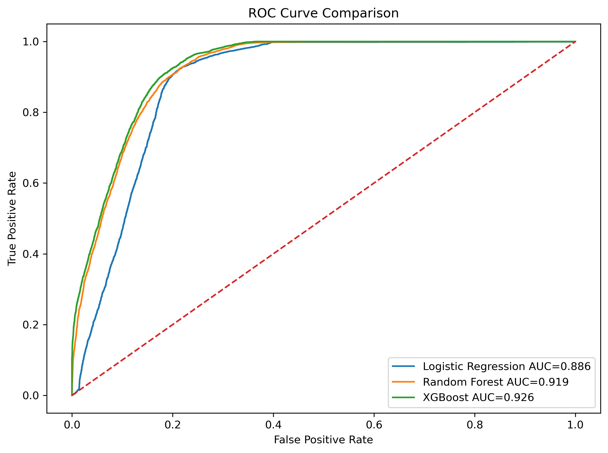

# Churn Prediction Model Comparison

## Objective

The objective of this phase is to evaluate multiple machine learning algorithms for customer churn prediction and identify the model that provides the best balance between predictive performance and business value.

Rather than relying on a single model, multiple algorithms were trained and compared to determine the most suitable solution for deployment.

---

# Connection to Previous Phase

In the previous phase, a churn prediction dataset was created using engineered customer features and a recency-based churn definition.

This phase builds upon that dataset by evaluating different machine learning approaches and selecting the strongest model.

---

# Dataset Overview

The dataset contains customer-level behavioral and transactional features generated during earlier project phases.

## Features Used

| Feature                  |
| ------------------------ |
| frequency                |
| monetary                 |
| avg_order_value          |
| category_count           |
| avg_review_score         |
| avg_delivery_days        |
| total_freight_paid       |
| customer_segment_encoded |

---

# Target Variable

## Churn

Customers whose recency exceeded the 75th percentile threshold (352 days) were classified as churned.

### Churn Definition

```python
churn_threshold = df["recency_days"].quantile(0.75)

df["churn"] = (
    df["recency_days"] > churn_threshold
).astype(int)
```

---

# Train-Test Split

The dataset was divided into:

* 80% Training Data
* 20% Testing Data

Stratified sampling was applied to preserve class proportions.

---

# Models Evaluated

Three machine learning models were evaluated.

## 1. Logistic Regression

Logistic Regression was selected as a baseline classification model because of its simplicity and interpretability.

### Advantages

* Easy to interpret
* Fast training time
* Strong baseline performance

### Limitations

* Assumes linear relationships
* Less capable of capturing complex interactions

---

## 2. Balanced Random Forest

Balanced Random Forest was selected to address class imbalance and capture non-linear relationships between customer features.

### Advantages

* Handles class imbalance effectively
* Captures complex feature interactions
* Provides feature importance analysis

### Limitations

* More complex than Logistic Regression
* Can become computationally expensive

---

## 3. XGBoost

XGBoost was evaluated as an advanced gradient boosting algorithm.

### Advantages

* Excellent predictive performance
* Handles non-linear relationships
* Strong regularization mechanisms
* Industry-standard machine learning algorithm

### Limitations

* Less interpretable
* Requires parameter tuning

---

# Evaluation Metrics

The following metrics were used to evaluate model performance.

| Metric    | Description                                           |
| --------- | ----------------------------------------------------- |
| Accuracy  | Overall prediction correctness                        |
| Precision | Percentage of predicted churners who actually churned |
| Recall    | Percentage of actual churners correctly identified    |
| F1 Score  | Harmonic mean of precision and recall                 |
| ROC-AUC   | Ability to distinguish churned and active customers   |

---

# Model Performance Comparison

| Model                  | Accuracy | Precision | Recall | F1 Score | ROC-AUC |
| ---------------------- | -------: | --------: | -----: | -------: | ------: |
| Logistic Regression    |    0.824 |     0.595 |  0.913 |    0.721 |   0.886 |
| Balanced Random Forest |    0.846 |     0.688 |  0.699 |    0.693 |   0.919 |
| XGBoost                |    0.852 |     0.667 |  0.812 |    0.732 |   0.926 |

---

# Model Comparison Visualization


## Observation

The comparison chart highlights differences in predictive performance across all evaluation metrics.

Each model demonstrates different strengths depending on the business objective.

---

# Logistic Regression Analysis

## Performance Summary

| Metric    | Value |
| --------- | ----: |
| Accuracy  | 82.4% |
| Precision | 59.5% |
| Recall    | 91.3% |
| F1 Score  | 72.1% |
| ROC-AUC   | 0.886 |

---

## Strengths

* Highest recall among all models
* Successfully identifies the majority of churned customers
* Highly interpretable

## Weaknesses

* Lower precision
* Lower ROC-AUC than tree-based models

## Business Interpretation

Logistic Regression is valuable when the primary objective is to identify as many churned customers as possible, even if some active customers are incorrectly flagged.

---

# Balanced Random Forest Analysis

## Performance Summary

| Metric    | Value |
| --------- | ----: |
| Accuracy  | 84.6% |
| Precision | 68.8% |
| Recall    | 69.9% |
| F1 Score  | 69.3% |
| ROC-AUC   | 0.919 |

---

## Strengths

* Highest precision among all models
* Strong overall performance
* Excellent ROC-AUC

## Weaknesses

* Lower recall than Logistic Regression and XGBoost

## Business Interpretation

Balanced Random Forest is useful when retention budgets are limited and minimizing false positives is important.

---

# XGBoost Analysis

## Performance Summary

| Metric    | Value |
| --------- | ----: |
| Accuracy  | 85.2% |
| Precision | 66.7% |
| Recall    | 81.2% |
| F1 Score  | 73.2% |
| ROC-AUC   | 0.926 |

---

## Strengths

* Highest accuracy
* Highest F1 Score
* Highest ROC-AUC
* Strong recall performance

## Weaknesses

* Less interpretable than Logistic Regression

## Business Interpretation

XGBoost provides the strongest balance between churn detection capability and prediction reliability.

---

# ROC Curve Comparison



## Findings

The ROC curves demonstrate that XGBoost consistently outperforms the other models across multiple classification thresholds.

The highest ROC-AUC score indicates superior discriminative capability.

---

# Customer Segment Ablation Study

An additional experiment was conducted to evaluate the contribution of customer segmentation.

The customer_segment_encoded feature was removed from the XGBoost model and the model was retrained.

---

## Results

| Metric   | With Segment | Without Segment |
| -------- | -----------: | --------------: |
| Accuracy |        85.2% |           77.0% |
| Recall   |        81.2% |           11.0% |
| F1 Score |        73.2% |           20.0% |

---

## Interpretation

Removing customer segmentation caused a substantial decline in model performance.

Key observations:

* Recall decreased from 81.2% to 11.0%.
* F1 Score decreased from 73.2% to 20.0%.
* Churn detection capability deteriorated significantly.

This demonstrates that customer segmentation captures highly valuable behavioral information that significantly improves churn prediction.

---

# Final Model Selection

## Selected Model

### XGBoost Classifier

After evaluating all models, XGBoost was selected as the final churn prediction model.

---

## Selection Criteria

| Criterion        | Result |
| ---------------- | ------ |
| Highest Accuracy | Yes    |
| Highest F1 Score | Yes    |
| Highest ROC-AUC  | Yes    |
| Strong Recall    | Yes    |

---

## Final Performance

| Metric    | Value |
| --------- | ----: |
| Accuracy  | 85.2% |
| Precision | 66.7% |
| Recall    | 81.2% |
| F1 Score  | 73.2% |
| ROC-AUC   | 0.926 |

---

# Business Impact

The selected model enables businesses to:

* Identify high-risk churn customers
* Prioritize retention campaigns
* Improve customer engagement
* Reduce customer attrition
* Increase long-term customer value

---

# Conclusion

This phase compared three machine learning algorithms for churn prediction:

* Logistic Regression
* Balanced Random Forest
* XGBoost

While Logistic Regression achieved the highest recall and Balanced Random Forest achieved the highest precision, XGBoost delivered the strongest overall performance.

The model achieved:

* Accuracy: 85.2%
* Precision: 66.7%
* Recall: 81.2%
* F1 Score: 73.2%
* ROC-AUC: 0.926

Based on these results, XGBoost was selected as the final production-ready churn prediction model.
