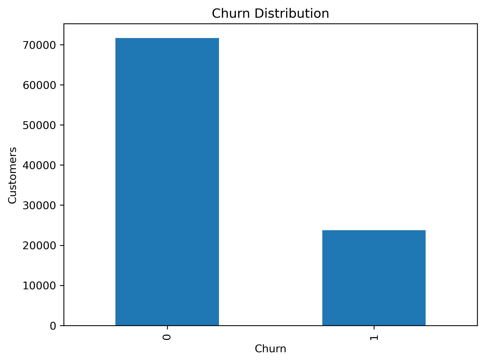

# Customer Churn Prediction

## Project Objective

The objective of this phase is to identify customers who are at risk of churning using customer behavioral, transactional, and engagement features generated during previous phases of the project.

Customer churn prediction enables businesses to proactively target retention campaigns, improve customer engagement, and reduce revenue loss caused by customer attrition.

---

# Connection to Previous Project Phases

This phase builds upon outputs generated during earlier stages of the project.

Previous completed phases include:

* SQL Analytics
* Customer Feature Engineering
* Customer Segmentation
* Customer Lifetime Value Analysis
* Revenue Forecasting
* Streamlit Business Intelligence Dashboard

The customer-level features generated in these phases were used as inputs for churn prediction.

---

# Business Problem

Customer acquisition is often more expensive than customer retention. Therefore, identifying customers who are likely to stop purchasing is a critical business objective.

The goal of this phase is to develop a machine learning model capable of predicting customer churn before customers permanently disengage from the platform.

---

# Churn Definition

The Olist dataset does not provide an explicit churn label.

Therefore, a proxy churn definition was created using customer inactivity.

## Recency Statistics

| Statistic       | Days |
| --------------- | ---: |
| Minimum         |    0 |
| 25th Percentile |  118 |
| Median          |  223 |
| 75th Percentile |  352 |
| Maximum         |  728 |

Customers whose recency exceeded the 75th percentile threshold were classified as churned.

### Churn Creation Logic

```python
churn_threshold = df["recency_days"].quantile(0.75)

df["churn"] = (
    df["recency_days"] > churn_threshold
).astype(int)
```

This approach creates a data-driven churn definition based on actual customer inactivity patterns.

---

# Churn Distribution



## Observation

The resulting dataset contains:

* Approximately 75% active customers
* Approximately 25% churned customers

This distribution reflects a realistic business environment where retained customers significantly outnumber churned customers.

---

# Feature Engineering

The churn model uses customer-level behavioral and transactional features generated during earlier project phases.

## Features Used

| Feature                  | Description                                           |
| ------------------------ | ----------------------------------------------------- |
| frequency                | Number of purchases made by customer                  |
| monetary                 | Total customer spending                               |
| avg_order_value          | Average spending per order                            |
| category_count           | Number of unique product categories purchased         |
| avg_review_score         | Average customer review score                         |
| avg_delivery_days        | Average delivery duration                             |
| total_freight_paid       | Total shipping cost paid                              |
| customer_segment_encoded | Encoded customer segment generated through clustering |

---

# Leakage Prevention

Several variables were intentionally excluded from model training.

## Excluded Features

| Feature              | Reason                                          |
| -------------------- | ----------------------------------------------- |
| recency_days         | Used to create churn target                     |
| customer_tenure_days | Highly correlated with recency                  |
| clv                  | Derived from multiple customer behavior metrics |

Removing these variables helps prevent target leakage and produces a more realistic model evaluation.

---

# Data Preparation

## Train-Test Split

The dataset was divided into:

* 80% Training Data
* 20% Testing Data

Stratified sampling was used to preserve class proportions.

```python
train_test_split(
    X,
    y,
    test_size=0.20,
    random_state=42,
    stratify=y
)
```

---

# Final Churn Prediction Model

## Selected Model

### XGBoost Classifier

XGBoost was selected as the final churn prediction model because it demonstrated the strongest overall predictive performance.

Advantages include:

* Strong predictive accuracy
* Effective handling of non-linear relationships
* Robustness against overfitting
* Industry-standard gradient boosting framework

---

# Model Performance

## Evaluation Metrics

| Metric    | Value |
| --------- | ----: |
| Accuracy  | 85.2% |
| Precision | 66.7% |
| Recall    | 81.2% |
| F1 Score  | 73.2% |
| ROC-AUC   | 0.926 |

---

# Interpretation of Results

## Accuracy

The model correctly classified approximately 85% of customers.

## Precision

Among customers predicted as churners, approximately 67% actually churned.

## Recall

The model successfully identified approximately 81% of churned customers.

This is particularly important because missing churned customers can lead to lost revenue and missed retention opportunities.

## ROC-AUC

A ROC-AUC score of 0.926 indicates excellent discriminative capability between churned and active customers.

The model can effectively rank customers according to their likelihood of churn.

---

# Confusion Matrix


## Findings

The confusion matrix demonstrates that the model correctly identifies the majority of churned customers while maintaining strong overall classification performance.

The relatively high recall indicates that the model is effective at detecting customers at risk of leaving.

---

# Feature Importance Analysis


## Feature Importance Scores

| Feature                  | Importance |
| ------------------------ | ---------: |
| customer_segment_encoded |      0.915 |
| avg_review_score         |      0.044 |
| total_freight_paid       |      0.010 |
| category_count           |      0.008 |
| avg_delivery_days        |      0.007 |
| monetary                 |      0.006 |
| avg_order_value          |      0.006 |
| frequency                |      0.003 |

---

# Key Findings

## Customer Segment Dominance

Customer segment emerged as the strongest predictor of churn.

This indicates that customer segmentation successfully captures meaningful behavioral patterns associated with customer retention and attrition.

## Customer Satisfaction

Review score was the second most influential variable.

Customers with lower satisfaction levels appear more likely to churn.

## Operational Factors

Shipping costs and delivery experience contributed to churn prediction, suggesting that logistics performance affects customer loyalty.

---

# Customer Segment Ablation Study

To evaluate the importance of customer segmentation, an additional experiment was conducted by removing the customer_segment_encoded feature.

## Results

| Metric   | With Segment | Without Segment |
| -------- | -----------: | --------------: |
| Accuracy |        85.2% |           77.0% |
| Recall   |        81.2% |           11.0% |
| F1 Score |        73.2% |           20.0% |

## Interpretation

Removing customer segmentation caused a substantial decline in predictive performance.

This demonstrates that customer segmentation captures valuable behavioral information that significantly improves churn prediction capability.

Therefore, customer_segment_encoded was retained in the final model.

---

# Business Insights

## Insight 1

Customer segments contain strong signals related to churn behavior.

## Insight 2

Customer satisfaction is an important indicator of retention risk.

## Insight 3

Delivery experience and shipping costs influence customer loyalty.

## Insight 4

Machine learning can effectively identify customers at risk of churn before they disengage completely.

---

# Business Recommendations

### Recommendation 1

Deploy the churn prediction model to continuously monitor customer churn risk.

### Recommendation 2

Prioritize retention campaigns for customers predicted as high-risk churners.

### Recommendation 3

Improve delivery performance and logistics efficiency.

### Recommendation 4

Monitor customer review scores and satisfaction metrics to identify disengaged customers early.

### Recommendation 5

Use customer segments as part of retention strategy design and campaign targeting.

---

# Limitations

Several limitations should be considered:

* The dataset does not contain a true churn indicator.
* Churn labels were created using a recency-based proxy definition.
* Additional behavioral and demographic variables may improve predictive performance.
* The model should be interpreted as a predictive analytics solution rather than a production-ready churn management system.

---

# Conclusion

This phase successfully developed a customer churn prediction system using machine learning and engineered customer features.

Key achievements include:

* Data-driven churn definition
* Leakage prevention
* Customer churn prediction
* Feature importance analysis
* Customer segment impact analysis
* Business insight generation

The final XGBoost model achieved:

* Accuracy: 85.2%
* Precision: 66.7%
* Recall: 81.2%
* F1 Score: 73.2%
* ROC-AUC: 0.926

These results demonstrate strong predictive capability and provide a foundation for proactive customer retention strategies.
