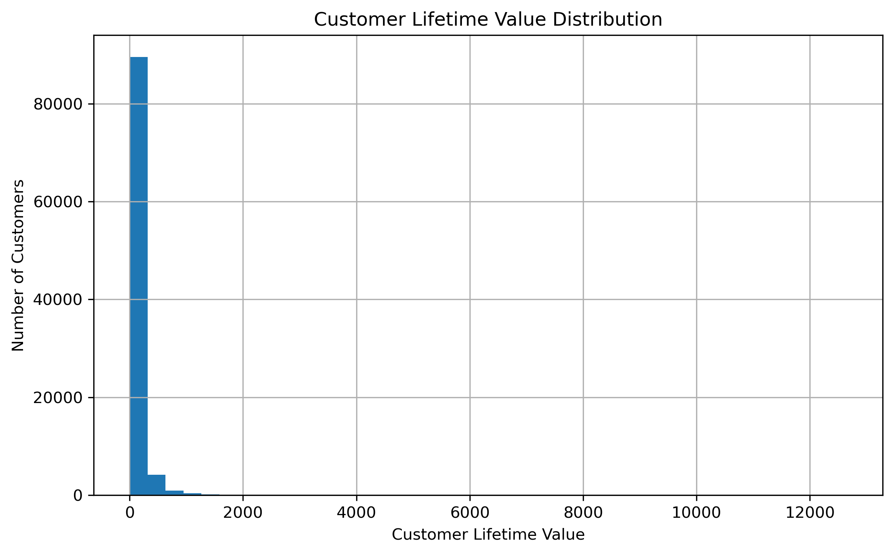
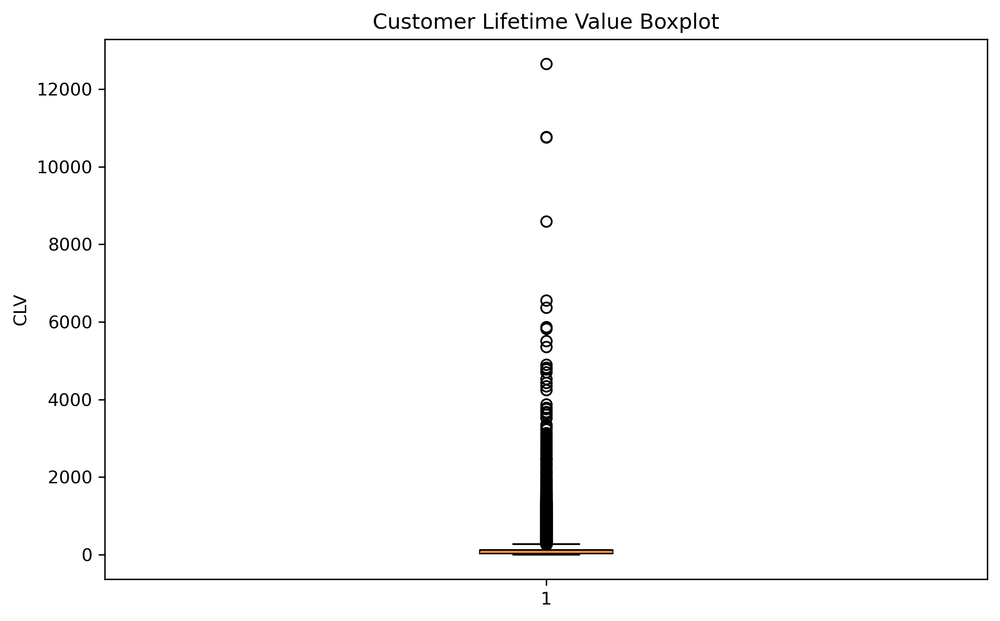
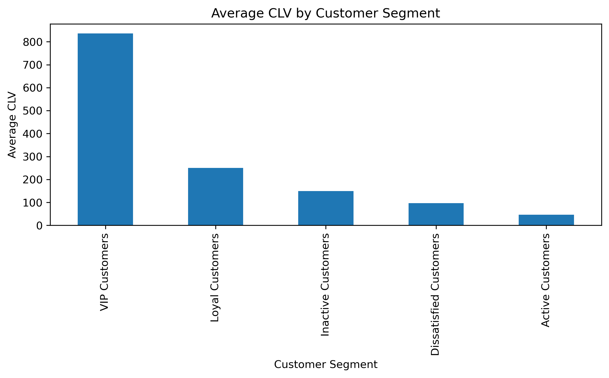
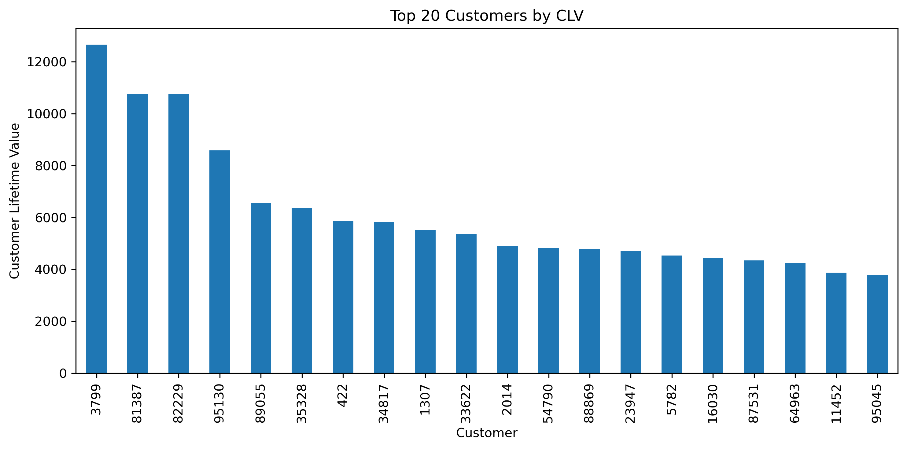

# Customer Lifetime Value (CLV) Analysis

## Objective

The objective of this phase was to estimate Customer Lifetime Value (CLV) for each customer and evaluate how customer value differs across the customer segments identified during the segmentation phase.

Customer Lifetime Value is one of the most important business metrics because it helps organizations understand which customers generate the greatest long-term value and where retention efforts should be focused.

This phase builds directly upon the customer segmentation model developed in the previous stage.

---

# Connection to Previous Project Phases

This phase extends the customer analytics pipeline developed earlier in the project.

Project Workflow:

Raw E-Commerce Data

↓

PostgreSQL Database

↓

SQL Analytics

↓

Customer Intelligence

↓

Feature Engineering

↓

Customer Segmentation

↓

Customer Lifetime Value Analysis

The customer segments generated during Day 7 are used to evaluate value differences across customer groups.

---

# Dataset Used

Source File:

customer_segments.csv

Number of Customers:

95,419

Features Used:

* frequency
* avg_order_value
* customer_tenure_days
* customer_segment

---

# Why Customer Lifetime Value Matters

Customer Lifetime Value estimates the total value a customer contributes throughout their relationship with a business.

CLV helps answer important business questions:

* Which customers generate the highest long-term revenue?
* Which customer groups should receive retention investments?
* Where should marketing resources be allocated?
* Which customers deserve loyalty benefits?

---

# CLV Calculation

A business-oriented CLV approximation was used.

Formula:

CLV = Average Order Value × Purchase Frequency × Customer Tenure

Implementation:

CLV = avg_order_value × frequency × (customer_tenure_days / 365)

This formula combines:

* Spending behavior
* Purchase frequency
* Length of customer relationship

into a single customer value metric.

---

# Feature Creation

A new feature named:

clv

was created for every customer.

This feature represents the estimated lifetime value of each customer.

Generated File:

* 

---

# Customer Lifetime Value Distribution

A distribution analysis was performed to understand how customer value is distributed across the customer base.

Generated Visualization:

* 

Observation:

Customer Lifetime Value is highly right-skewed.

Most customers generate relatively low value, while a small proportion contribute significantly higher lifetime revenue.

Business Insight:

A relatively small number of customers drive a disproportionately large share of overall business value.

---

# CLV Boxplot Analysis

A boxplot was used to identify high-value customer outliers.

Generated Visualization:

* 

Observation:

Several customers exhibit exceptionally high CLV values compared to the overall customer population.

Business Insight:

These customers represent valuable retention targets and should be prioritized for loyalty programs.

---

# CLV by Customer Segment

Average CLV was calculated for each customer segment identified.

Results:

| Customer Segment       | Average CLV |
| ---------------------- | ----------: |
| VIP Customers          |      836.21 |
| Loyal Customers        |      250.35 |
| Inactive Customers     |      149.02 |
| Dissatisfied Customers |       96.69 |
| Active Customers       |       46.19 |

Generated Visualization:

* 

---

# Segment-Level Interpretation

## VIP Customers

Average CLV:

836.21

Characteristics:

* Highest spending behavior
* Highest order values
* Highest overall customer value

Business Interpretation:

VIP Customers represent the most valuable segment and generate significantly higher revenue than all other customer groups.

Recommended Actions:

* Premium loyalty programs
* Exclusive offers
* Personalized experiences
* Priority customer support

---

## Loyal Customers

Average CLV:

250.35

Characteristics:

* High purchase frequency
* Strong long-term engagement
* Diverse purchasing behavior

Business Interpretation:

Loyal Customers provide consistent long-term value and represent an important growth opportunity.

Recommended Actions:

* Membership programs
* Reward systems
* Retention campaigns

---

## Inactive Customers

Average CLV:

149.02

Characteristics:

* Previously generated moderate value
* Long periods of inactivity

Business Interpretation:

Although currently inactive, these customers have historically contributed meaningful revenue.

Recommended Actions:

* Win-back campaigns
* Personalized discounts
* Re-engagement initiatives

---

## Dissatisfied Customers

Average CLV:

96.69

Characteristics:

* Low satisfaction scores
* Delivery-related issues

Business Interpretation:

Poor customer experiences may have negatively affected customer value.

Recommended Actions:

* Service recovery programs
* Customer support improvements
* Delivery optimization

---

## Active Customers

Average CLV:

46.19

Characteristics:

* Recently active
* High satisfaction
* Limited purchasing history

Business Interpretation:

These customers are relatively new and currently generate lower lifetime value.

Recommended Actions:

* Cross-selling
* Upselling
* Personalized product recommendations

---

# Top Customer Analysis

The highest-value customers were identified based on CLV.

Generated Visualization:

* 

Observation:

A small number of customers contribute substantially more value than the average customer.

Business Insight:

Retaining top-value customers can have a significant impact on overall revenue.

---

# Key Business Insights

## Customer Value Concentration

Customer Lifetime Value is heavily concentrated among a relatively small customer segment.

VIP Customers generate significantly more value than other customer groups.

---

## Retention Priority

Although VIP Customers generate the highest revenue, Loyal Customers represent a strategic retention opportunity because of their repeat purchasing behavior and long-term engagement.

---

## Activity Does Not Equal Value

One of the most interesting findings is that Active Customers exhibit the lowest average CLV despite being recently engaged.

This indicates that recency alone does not determine customer value.

Customer value depends on a combination of:

* Spending behavior
* Purchase frequency
* Customer tenure

---

## Customer Experience Matters

The Dissatisfied Customer segment demonstrates that poor customer experiences can negatively impact long-term customer value.

Improving service quality may increase retention and customer lifetime value.

---

# Business Recommendations

| Customer Segment       | Recommended Strategy                  |
| ---------------------- | ------------------------------------- |
| VIP Customers          | Loyalty programs and exclusive offers |
| Loyal Customers        | Retention and membership programs     |
| Inactive Customers     | Win-back campaigns                    |
| Dissatisfied Customers | Service recovery initiatives          |
| Active Customers       | Cross-selling and upselling           |

---

# Deliverables

Generated Files:

* 
* 
* 

Generated Visualizations:

* 
* 
* 
* 

---

# Business Impact

Customer Lifetime Value analysis enables businesses to allocate resources more effectively by identifying high-value customers and prioritizing retention initiatives.

The analysis supports:

* Revenue Optimization
* Customer Retention
* Loyalty Program Design
* Personalized Marketing
* Customer Relationship Management

---

# Project Impact

The CLV framework extends the customer segmentation model by quantifying customer value.

This creates a stronger foundation for:

* Revenue Forecasting
* Predictive Analytics
* Executive Dashboards
* AI-Powered Business Intelligence Systems

---

# Next Steps

The next phase focuses on forecasting and predictive analytics.

Planned activities include:

1. Revenue Forecasting

2. Monthly Sales Trend Analysis

3. Time Series Modeling

4. Business KPI Forecasting

5. Dashboard Integration
