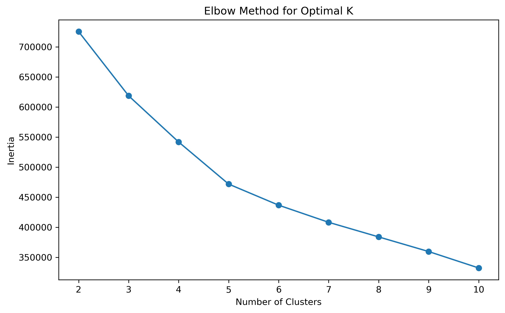
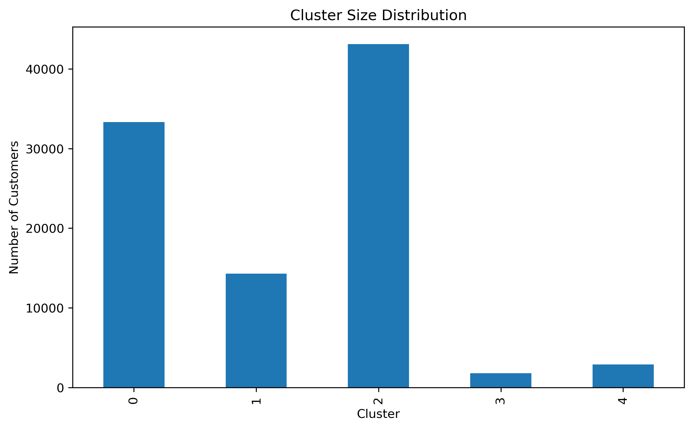
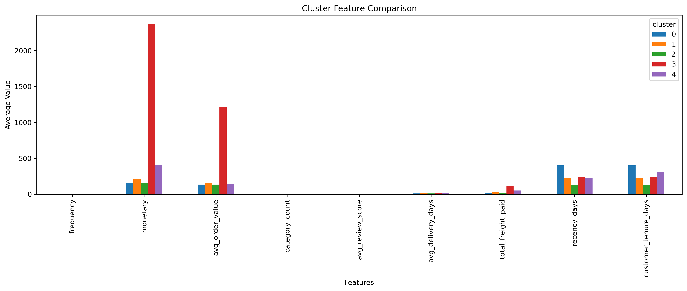
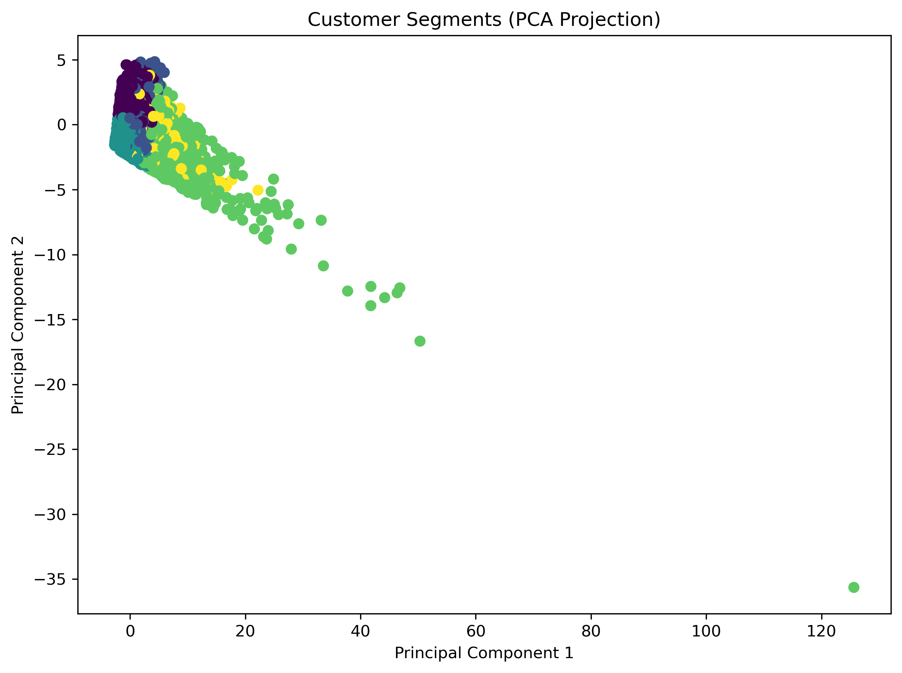

# Customer Segmentation

## Objective

The objective of this phase was to identify distinct customer groups based on purchasing behavior, spending patterns, customer satisfaction, delivery experience, and engagement history.

Customer segmentation enables businesses to understand customer behavior at a deeper level and design targeted marketing, retention, and loyalty strategies.

This phase leverages the customer-level features engineered during the previous stage and applies unsupervised machine learning techniques to discover meaningful customer segments.

---

# Connection to Previous Project Phases

This phase directly builds upon the feature engineering pipeline developed earlier in the project.

Project Workflow:

Raw E-Commerce Data

↓

PostgreSQL Database

↓

SQL Analytics

↓

Customer Intelligence

↓

Feature Engineering

↓

Customer Segmentation

The clustering model uses the customer-level dataset generated during the feature engineering stage.

---

# Dataset Used

Source File:

customer_features_ml.csv

Total Customers:

95,419

Features Used:

* frequency
* monetary
* avg_order_value
* category_count
* avg_review_score
* avg_delivery_days
* total_freight_paid
* recency_days
* customer_tenure_days

---

# Data Preprocessing

## Feature Selection

Only behavioral and transactional customer features were used for clustering.

The following fields were removed before clustering:

* customer_unique_id
* first_purchase
* last_purchase

These columns do not contribute to similarity calculations and may introduce unnecessary noise.

---

## Feature Scaling

StandardScaler was applied to normalize all features before clustering.

Reason:

The selected features operate on different numerical scales.

Examples:

* monetary values can exceed 2000
* review scores range from 1 to 5
* frequency values remain close to 1

Without scaling, large numerical features would dominate the clustering process.

---

# Determining the Optimal Number of Clusters

## Elbow Method

The Elbow Method was used to evaluate clustering performance for different values of K.

Observation:

The inertia curve exhibited a noticeable bend around K = 5, suggesting diminishing returns beyond five clusters.

Generated Visualization:

* elbow_method.png

---

## Silhouette Analysis

Silhouette scores were computed for cluster counts ranging from 2 to 10.

Results:

| K  | Silhouette Score |
| -- | ---------------- |
| 2  | 0.2566           |
| 3  | 0.2742           |
| 4  | 0.2865           |
| 5  | 0.3150           |
| 6  | 0.3179           |
| 7  | 0.2370           |
| 8  | 0.2477           |
| 9  | 0.2487           |
| 10 | 0.2603           |

Observation:

Although K = 6 achieved the highest silhouette score, K = 5 produced a nearly identical score while offering more interpretable customer segments.

---

## Final Cluster Selection

Final Value:

K = 5

Reason:

K = 5 provided a balance between clustering quality and business interpretability.

---

# Clustering Algorithm

Algorithm:

K-Means Clustering

Reason:

K-Means is widely used for customer segmentation due to its scalability, efficiency, and ease of interpretation.

---

# Cluster Distribution

| Cluster   | Customers |
| --------- | --------: |
| Cluster 0 |    33,333 |
| Cluster 1 |    14,286 |
| Cluster 2 |    43,122 |
| Cluster 3 |     1,792 |
| Cluster 4 |     2,886 |

Observation:

The majority of customers belong to Active and Inactive customer groups, while smaller clusters represent highly valuable and loyal customer segments.

Generated Visualization:

* cluster_size_distribution.png

---

# Cluster Profiling

Cluster profiles were created by calculating the average value of each feature within every cluster.

Generated Files:

* cluster_profiles.csv

Generated Visualizations:

* cluster_profiles.png
* standardized_cluster_profiles.png

---

## Cluster 0 – Inactive Customers

### Characteristics

* Single purchase customers
* Low spending behavior
* High recency values
* Long periods of inactivity

### Business Interpretation

These customers have not engaged with the platform recently and are at risk of churn.

### Recommended Actions

* Win-back campaigns
* Personalized discount offers
* Email remarketing
* Retargeting advertisements

---

## Cluster 1 – Dissatisfied Customers

### Characteristics

* Extremely low review scores
* Longer delivery durations
* Low purchase frequency
* Moderate spending behavior

### Business Interpretation

These customers likely experienced poor service quality or delivery-related issues.

### Recommended Actions

* Improve delivery operations
* Customer support outreach
* Service recovery initiatives
* Complaint resolution programs

---

## Cluster 2 – Active Customers

### Characteristics

* Lowest recency values
* Highest customer satisfaction scores
* Recent purchasing activity
* Consistent spending behavior

### Business Interpretation

This segment represents currently engaged and satisfied customers.

### Recommended Actions

* Personalized product recommendations
* Cross-selling campaigns
* Retention-focused marketing
* Promotional offers

---

## Cluster 3 – VIP Customers

### Characteristics

* Highest monetary value
* Highest average order value
* Significant freight spending
* Premium purchasing behavior

### Business Interpretation

This segment generates disproportionately high revenue and represents the most valuable customers.

### Recommended Actions

* Premium loyalty programs
* Exclusive promotions
* Priority customer support
* Early access to products

---

## Cluster 4 – Loyal Customers

### Characteristics

* Highest purchase frequency
* Highest category diversity
* Strong long-term engagement
* Above-average spending

### Business Interpretation

These customers repeatedly purchase products and exhibit strong brand loyalty.

### Recommended Actions

* Loyalty reward programs
* Membership benefits
* Personalized retention initiatives
* Exclusive product bundles

---

# PCA-Based Cluster Visualization

Principal Component Analysis (PCA) was used to project the nine-dimensional feature space into two dimensions for visualization.

Generated Visualization:

* customer_clusters_pca.png

Observation:

One customer segment exhibits highly distinct behavioral characteristics, while the remaining segments show partial overlap.

This behavior is expected because customer purchasing patterns exist on a continuum rather than forming perfectly separated groups.

Despite some overlap in the PCA projection, cluster profiling revealed meaningful differences in spending behavior, customer satisfaction, recency, and purchasing diversity.

---

# Standardized Cluster Comparison

To facilitate comparison across features with different numerical scales, cluster profiles were standardized using StandardScaler.

This visualization highlights relative differences among customer segments while eliminating distortions caused by large monetary values.

Key Observations:

* VIP Customers exhibit exceptionally high monetary value and average order value.
* Loyal Customers demonstrate the highest purchase frequency and category diversity.
* Active Customers show the lowest recency and highest customer satisfaction.
* Dissatisfied Customers exhibit poor review scores and longer delivery times.
* Inactive Customers have the highest recency values, indicating prolonged inactivity.

---

# Key Business Insights

## Customer Value Distribution

A relatively small customer segment contributes disproportionately to overall revenue.

The VIP segment represents the highest-value customer group.

---

## Customer Retention Opportunity

A large proportion of customers belong to the Inactive segment, highlighting opportunities for reactivation campaigns.

---

## Customer Satisfaction Impact

The Dissatisfied customer segment demonstrates the impact of poor customer experiences and delivery issues on customer behavior.

---

## Customer Loyalty

Loyal Customers exhibit higher purchase frequency and greater product category diversity, making them ideal candidates for loyalty programs.

---

## Frequency Observation

The analysis revealed that purchase frequency alone is not a strong differentiator across most customer groups.

Most customers placed only a single order.

Customer value is influenced more strongly by:

* Spending behavior
* Customer satisfaction
* Recency
* Purchasing diversity
* Delivery experience

---

## Deliverables

Generated Files:

* 
* 
* 
* 

Visualizations:

* 
* 
* 
* 
* 

---

# Business Impact

Customer segmentation enables data-driven customer relationship management by identifying distinct customer personas and supporting targeted business strategies.

The resulting segments can be used for:

* Customer Retention Programs
* Loyalty Initiatives
* Personalized Marketing
* Revenue Optimization
* Customer Lifetime Value Analysis

---

# Project Impact

The generated customer segments become a key input for future project phases, including:

* Customer Lifetime Value Prediction
* Revenue Forecasting
* Business KPI Forecasting
* Executive Dashboard Development
* AI Business Intelligence Copilot

---

# Next Steps

The next phase focuses on predictive analytics and forecasting.

Planned activities include:

1. Customer Lifetime Value Analysis

2. Revenue Forecasting

3. Time Series Modeling

4. Business KPI Prediction

5. Dashboard Integration
