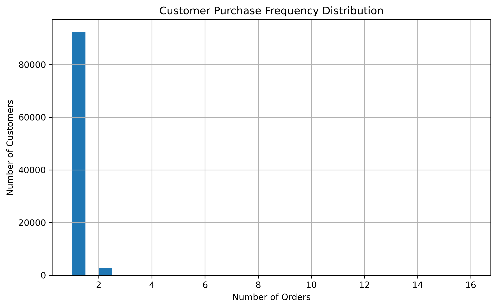
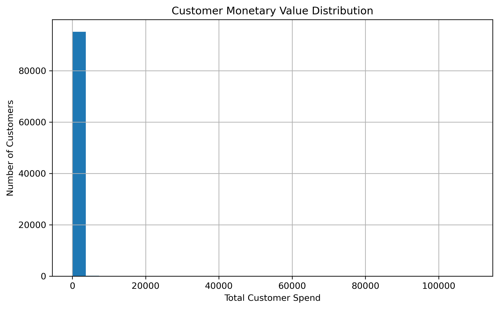
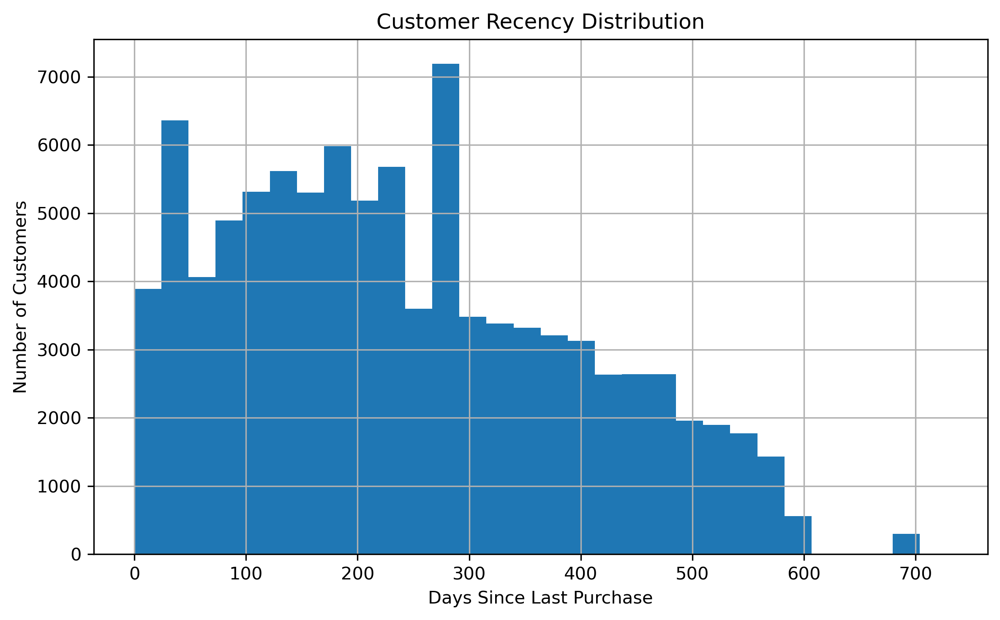
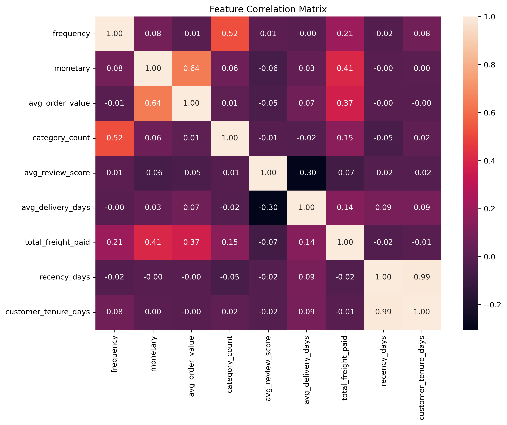

# Feature Engineering

## Objective

The objective of this phase was to transform transactional e-commerce data into a customer-level analytical dataset suitable for machine learning applications.

A feature engineering layer was developed using PostgreSQL and Python to aggregate customer behavior, purchasing patterns, satisfaction indicators, and delivery-related information into a unified analytical dataset.

The resulting dataset will serve as the foundation for customer segmentation, customer lifetime value analysis, retention modeling, and business intelligence applications.

---

## Data Source

### PostgreSQL Database

Database:

ecommerce_analytics

### Feature Engineering View

customer_features_v2

The feature engineering view was created using SQL aggregations across multiple tables:

* customers
* orders
* payments
* order_items
* products
* reviews

This view provides a consolidated customer-level representation of transactional behavior.

---

## Features Generated in SQL

### frequency

Definition:

Total number of orders placed by a customer.

Business Value:

Measures customer engagement and purchasing frequency.

---

### monetary

Definition:

Total revenue generated by a customer.

Business Value:

Represents overall customer value and spending behavior.

---

### avg_order_value

Definition:

Average amount spent per order.

Business Value:

Identifies customers with high-value purchasing behavior.

---

### first_purchase

Definition:

Date of the customer's first recorded purchase.

Business Value:

Used to calculate customer tenure.

---

### last_purchase

Definition:

Date of the customer's most recent purchase.

Business Value:

Used to calculate customer recency.

---

### category_count

Definition:

Number of distinct product categories purchased.

Business Value:

Measures diversity of customer purchasing behavior.

---

### avg_review_score

Definition:

Average review score submitted by the customer.

Business Value:

Acts as a proxy for customer satisfaction.

---

### avg_delivery_days

Definition:

Average number of days required to deliver customer orders.

Business Value:

Measures delivery efficiency and customer experience.

---

### total_freight_paid

Definition:

Total shipping charges paid by the customer.

Business Value:

Provides insight into logistics costs and purchasing patterns.

---

## Features Engineered in Python

### recency_days

Definition:

Number of days since the customer's most recent purchase.

Formula:

Reference Date − Last Purchase Date

Business Value:

Lower values indicate more recently active customers.

---

### customer_tenure_days

Definition:

Number of days since the customer's first purchase.

Formula:

Reference Date − First Purchase Date

Business Value:

Represents the duration of the customer's relationship with the platform.

---

## Missing Value Handling

Two engineered features contained missing values:

### avg_review_score

Reason:

Some customers did not submit reviews for their purchases.

Treatment:

Missing values were replaced using median imputation.

---

### avg_delivery_days

Reason:

Certain orders were cancelled or lacked delivery information.

Treatment:

Missing values were replaced using median imputation.

---

## Final Feature Set

The final analytical dataset contains the following features:

* customer_unique_id
* frequency
* monetary
* avg_order_value
* first_purchase
* last_purchase
* category_count
* avg_review_score
* avg_delivery_days
* total_freight_paid
* recency_days
* customer_tenure_days

---

## Exploratory Analysis

Several visualizations were created to understand customer behavior and validate engineered features.

### Customer Purchase Frequency Distribution

Observation:

Most customers placed a single order, while a relatively small proportion became repeat buyers.

Business Insight:

Customer retention represents a significant opportunity for growth.

---

### Customer Monetary Value Distribution

Observation:

Customer spending is highly right-skewed.

Business Insight:

A small number of customers contribute disproportionately to overall revenue.

---

### Average Order Value Distribution

Observation:

Most transactions occur at lower spending levels, with relatively few high-value purchases.

Business Insight:

The platform primarily serves moderate-spending customers while maintaining a small premium customer segment.

---

### Customer Recency Distribution

Observation:

Customers exhibit a wide range of activity levels.

Business Insight:

Recency can serve as a strong predictor of future purchasing behavior.

---

### Customer Monetary Value Boxplot

Observation:

A large number of high-value outliers are present.

Business Insight:

These customers may represent potential VIP segments suitable for loyalty initiatives.

---

### Feature Correlation Analysis

Purpose:

Evaluate relationships between engineered variables.

Observation:

Several features exhibit meaningful relationships that can improve customer segmentation and predictive modeling.

Business Insight:

The engineered feature set captures multiple dimensions of customer behavior, including spending, engagement, satisfaction, and purchasing diversity.

---

## Deliverables

Generated Files:

* 
* 
* 
* 
* 

Visualizations:

* 
* 
* 
* 
* 
* 

---

## Business Impact

The engineered dataset transforms raw transactional data into a machine-learning-ready representation of customer behavior.

The generated features provide valuable insights into:

* Customer Value
* Customer Retention
* Customer Satisfaction
* Purchasing Diversity
* Delivery Experience

---

## Project Impact

The customer feature dataset will be directly reused in subsequent project phases:

* Customer Segmentation
* RFM Analysis
* K-Means Clustering
* Customer Lifetime Value Prediction
* Forecasting Models
* AI-Powered Business Intelligence Dashboard

---

## Next Steps

The next phase focuses on Customer Segmentation.

Planned activities include:

1. Feature Scaling

2. Exploratory Cluster Analysis

3. K-Means Clustering

4. Customer Persona Development

5. Segment Interpretation

6. Business Recommendations

