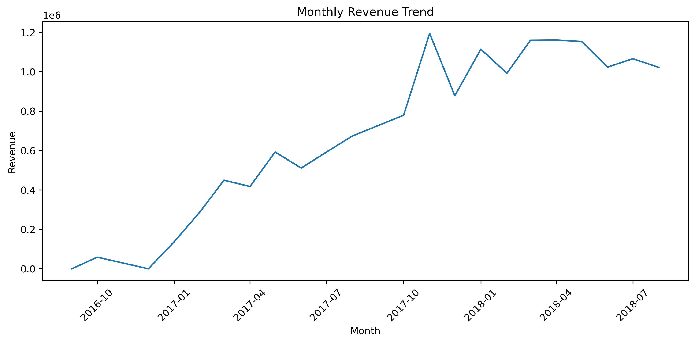
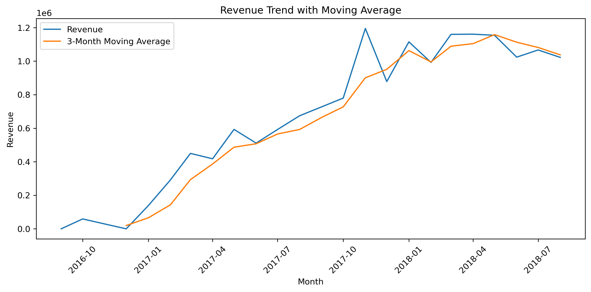
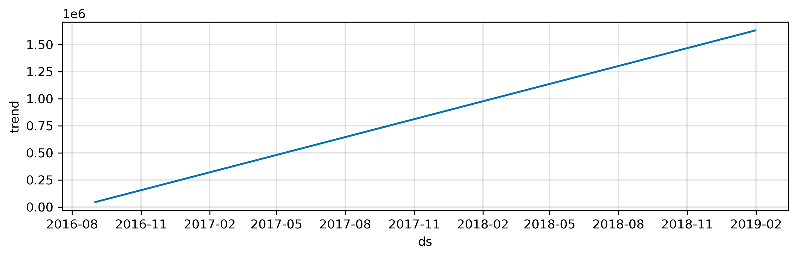
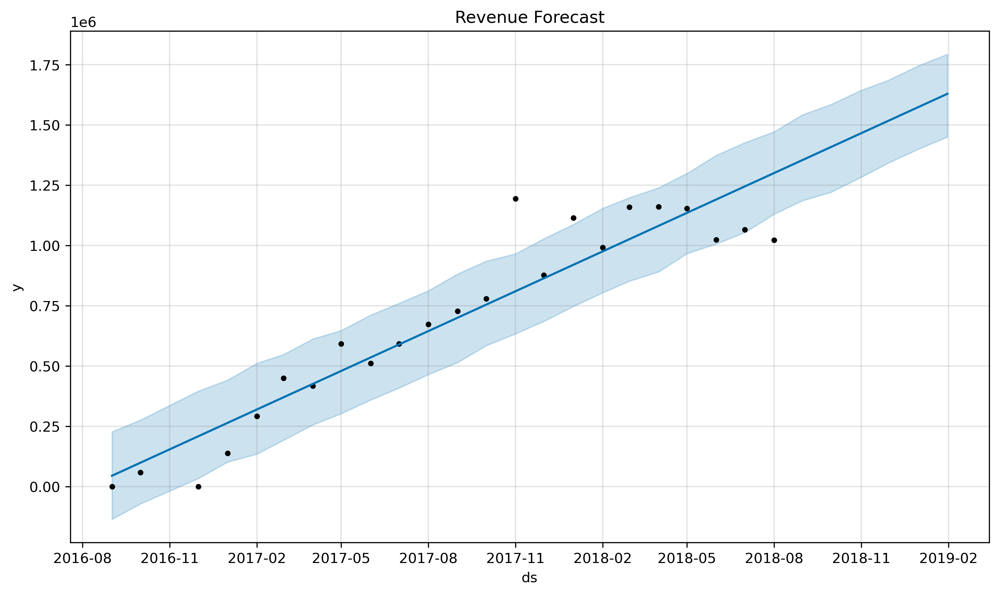

# Revenue Forecasting

## Project Objective

The objective of this phase was to analyze historical monthly revenue patterns and forecast future revenue trends using time-series forecasting techniques. Revenue forecasting helps businesses estimate future sales performance, support strategic planning, optimize inventory management, and improve resource allocation decisions.

---

## Connection to Previous Phases

The previous phases focused on understanding customer behavior and business performance through:

- SQL Analytics
- Customer Intelligence Analysis
- Feature Engineering
- Customer Segmentation
- Customer Lifetime Value (CLV) Analysis

This phase extends those analyses by forecasting future business revenue using historical transaction data.

---

## Revenue Aggregation

Monthly revenue was calculated by joining the orders and payments tables and aggregating payment values at the monthly level.

### SQL Query

```sql
SELECT
    DATE_TRUNC('month', o.order_purchase_timestamp) AS month,
    SUM(p.payment_value) AS revenue
FROM orders o
JOIN payments p
    ON o.order_id = p.order_id
GROUP BY month
ORDER BY month;
```

The resulting dataset contained monthly revenue observations from September 2016 to August 2018.

---

## Data Preparation

Before training the forecasting model, incomplete months at the end of the dataset were removed.

The original dataset contained:

| Month | Revenue |
|---------|---------:|
| 2018-09 | 4,439 |
| 2018-10 | 590 |

These months were incomplete because the dataset collection ended during these periods. Including them would have introduced artificial revenue declines and negatively impacted forecast quality.

Therefore, only complete monthly observations were used for forecasting.

---

## Monthly Revenue Trend Analysis

### Revenue Trend Visualization



### Findings

- Revenue increased substantially throughout the observation period.
- Monthly revenue grew from less than 100,000 during the early stages of the business to more than 1 million during 2018.
- Revenue growth indicates strong business expansion and increasing customer purchasing activity.
- Revenue remained consistently high throughout most of 2018.

---

## Moving Average Analysis

### Revenue Trend with Moving Average



### Findings

A 3-month moving average was used to smooth short-term fluctuations and reveal the underlying revenue trend.

Key observations:

- The moving average confirms a sustained upward revenue trajectory.
- Revenue growth was not driven by isolated spikes.
- The business maintained positive growth momentum throughout the majority of the observation period.
- Revenue remained relatively stable above one million during 2018.

---

## Forecasting Methodology

### Model Selection

Facebook Prophet was selected for revenue forecasting because:

- It handles time-series data effectively.
- It automatically captures trend and seasonality.
- It requires minimal preprocessing.
- It is widely used in business forecasting applications.

### Forecast Horizon

The model was used to forecast revenue for the next six months beyond the available historical data.

---

## Trend Component Analysis

### Prophet Trend Component



### Findings

The trend component identified a strong positive long-term revenue trajectory.

Observations:

- Revenue exhibits consistent growth over time.
- No evidence of a long-term decline was detected.
- The business appears to be expanding steadily.

---

## Seasonality Analysis

The forecasting model detected potential seasonal fluctuations throughout the year.

However, the available dataset contains approximately two years of historical observations. Therefore:

- Seasonal patterns should be interpreted cautiously.
- Additional historical data would improve seasonality estimation.
- The trend component is more reliable than the seasonal component in this analysis.

---

## Revenue Forecast

### Revenue Forecast Visualization



### Findings

The forecasting model predicts continued revenue growth during the forecast period.

Key observations:

- Revenue is expected to remain at historically high levels.
- No significant decline is anticipated.
- Growth momentum is expected to continue in the near future.
- The forecast confidence interval reflects uncertainty associated with future business conditions.

---

## Model Evaluation

### Residual Distribution


### Findings

Residual analysis was performed to evaluate forecasting performance.

Observations:

- Forecasting errors are reasonably centered around zero.
- Both positive and negative residuals are present.
- No severe systematic forecasting bias was observed.
- The model captures the overall revenue trend adequately.

---

## Business Insights

### Insight 1: Strong Revenue Growth

Revenue increased significantly from the beginning of the observation period, demonstrating strong business expansion.

### Insight 2: Revenue Stabilization

The company achieved and maintained monthly revenue levels exceeding one million during 2018.

### Insight 3: Sustained Growth Trend

The moving average confirms that revenue growth is sustained rather than driven by temporary spikes.

### Insight 4: Positive Future Outlook

Forecast results suggest that revenue growth is likely to continue in upcoming months.

### Insight 5: Business Scalability

The observed trend indicates that the business has successfully scaled its operations and customer base over time.

---

## Recommendations

Based on the forecasting results, the following recommendations are proposed:

### Recommendation 1

Increase inventory planning to accommodate expected future demand.

### Recommendation 2

Continue investing in customer acquisition and retention strategies.

### Recommendation 3

Monitor seasonal sales patterns as more historical data becomes available.

### Recommendation 4

Update forecasting models periodically using newly collected transaction data.

### Recommendation 5

Use revenue forecasts to support budgeting and resource allocation decisions.

---

## Limitations

Several limitations should be considered when interpreting the results:

- The dataset contains approximately two years of monthly observations.
- Forecast accuracy could improve with additional historical data.
- Seasonal effects should be interpreted cautiously.
- Forecasts represent directional business insights rather than exact future revenue values.

---

## Conclusion

This phase successfully transformed historical transaction data into actionable revenue forecasts.

Key achievements include:

- Monthly revenue aggregation using SQL.
- Revenue trend analysis.
- Moving average trend evaluation.
- Time-series forecasting using Prophet.
- Forecast performance assessment.
- Business insight generation and strategic recommendations.

The results indicate strong historical revenue growth and suggest that the business is likely to maintain positive revenue performance in the near future.