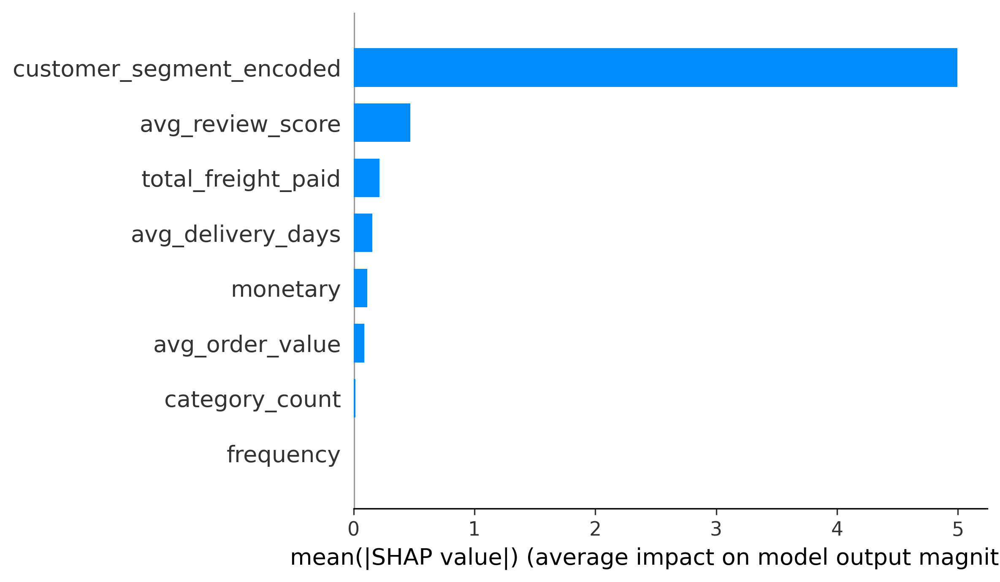
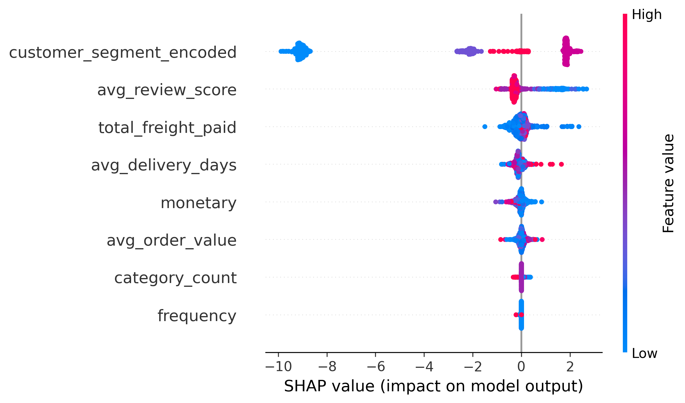
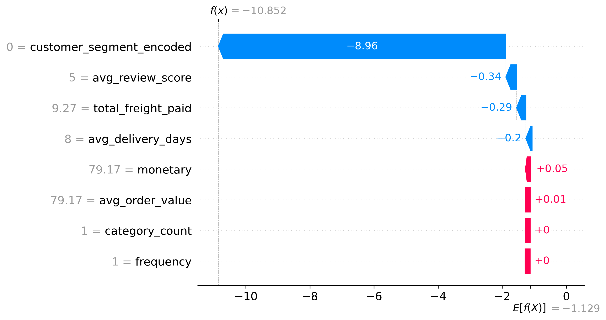

# Churn Prediction Explainability using SHAP

## Objective

While the XGBoost churn prediction model achieved strong predictive performance, understanding **why** the model predicts customer churn is equally important.

To improve model transparency and interpretability, SHAP (SHapley Additive exPlanations) was used.

SHAP provides:

- Global feature importance
- Feature impact direction
- Individual prediction explanations
- Business-level insights for customer retention strategies

---

# SHAP Feature Importance Analysis

## SHAP Bar Plot

### Interpretation

The SHAP bar plot shows the average impact of each feature on churn predictions across all customers.

### Most Important Features

| Rank | Feature |
|--------|----------|
| 1 | customer_segment_encoded |
| 2 | avg_review_score |
| 3 | total_freight_paid |
| 4 | avg_delivery_days |
| 5 | monetary |
| 6 | avg_order_value |
| 7 | category_count |
| 8 | frequency |

### Key Finding

Customer segment is by far the strongest predictor of churn.

The model relies heavily on customer segmentation information to determine whether a customer is likely to become inactive.

This indicates that purchasing behavior patterns captured through customer segmentation provide significant information about future churn risk.

---

# SHAP Summary Plot

## Interpretation

The SHAP summary plot provides both:

- Feature importance
- Direction of impact

Each point represents a customer.

### Color Meaning

- Blue → Low feature value
- Red → High feature value

### Horizontal Position

- Positive SHAP Value → Increases churn probability
- Negative SHAP Value → Decreases churn probability

---

## Customer Segment Impact

Customer segment shows the largest spread of SHAP values.

Different customer segments contribute very differently to churn predictions.

Certain customer segments strongly increase churn probability while others significantly reduce churn risk.

This confirms that customer segmentation is an effective strategy for identifying retention priorities.

---

## Review Score Impact

Review score is the second most important feature.

Customers with lower review scores tend to contribute positively toward churn predictions.

This suggests that poor customer experience is associated with higher churn risk.

---

## Freight Cost Impact

Freight cost also influences churn behavior.

Customers paying higher freight charges tend to show increased churn probability.

This indicates that shipping costs may negatively affect long-term customer retention.

---

## Delivery Performance Impact

Delivery time contributes to churn predictions as well.

Longer delivery durations increase churn risk while shorter delivery times reduce churn probability.

This highlights the importance of logistics performance in customer satisfaction.

---

# Individual Customer Explanation

## SHAP Waterfall Plot

The waterfall plot explains a single customer prediction.

The model prediction starts from the average churn baseline and then adjusts based on customer-specific characteristics.

### Major Contributors

| Feature | Contribution |
|----------|----------|
| customer_segment_encoded | Largest impact |
| avg_review_score | Moderate impact |
| total_freight_paid | Moderate impact |
| avg_delivery_days | Moderate impact |
| monetary | Small impact |

### Example Interpretation

For this customer:

- Customer segment strongly reduced churn probability.
- Review score reduced churn risk.
- Freight cost slightly reduced churn probability.
- Delivery performance also contributed toward lower churn risk.

The combined effect resulted in a very low predicted churn probability.

---

# Business Insights

The SHAP analysis reveals several actionable insights:

### 1. Customer Segmentation Drives Churn

Customer segment is the strongest determinant of churn behavior.

Retention strategies should therefore be customized for different customer segments rather than applying a uniform approach.

---

### 2. Customer Experience Matters

Review scores significantly influence churn predictions.

Improving customer satisfaction can directly reduce future churn risk.

---

### 3. Logistics Performance Impacts Retention

Delivery delays contribute to customer churn.

Reducing delivery times may improve customer retention.

---

### 4. Shipping Costs Influence Customer Behavior

High freight costs are associated with increased churn risk.

Companies should monitor shipping expenses and explore cost optimization strategies.

---

# Conclusion

SHAP explainability successfully transformed the XGBoost churn prediction model from a black-box model into an interpretable decision-support system.

The analysis identified:

- Customer segment as the dominant churn driver.
- Review score as a key indicator of customer satisfaction.
- Freight cost and delivery performance as operational factors influencing retention.

These findings provide actionable business insights that can be used to design targeted customer retention strategies and improve overall customer lifetime value.