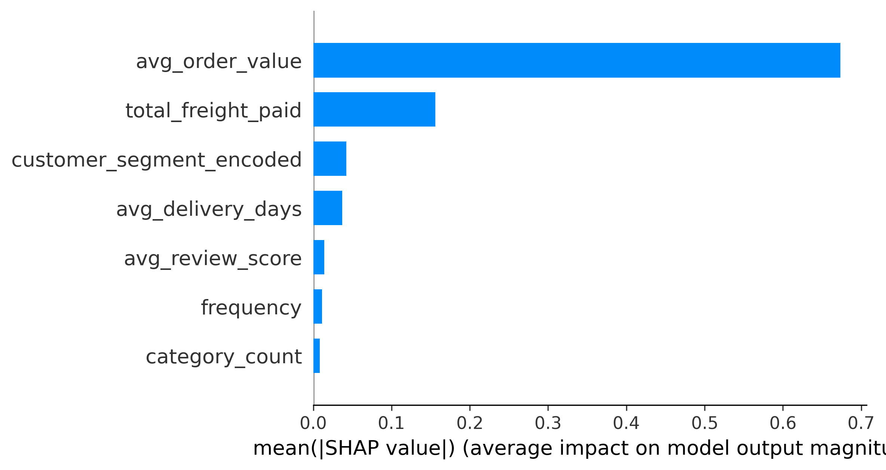
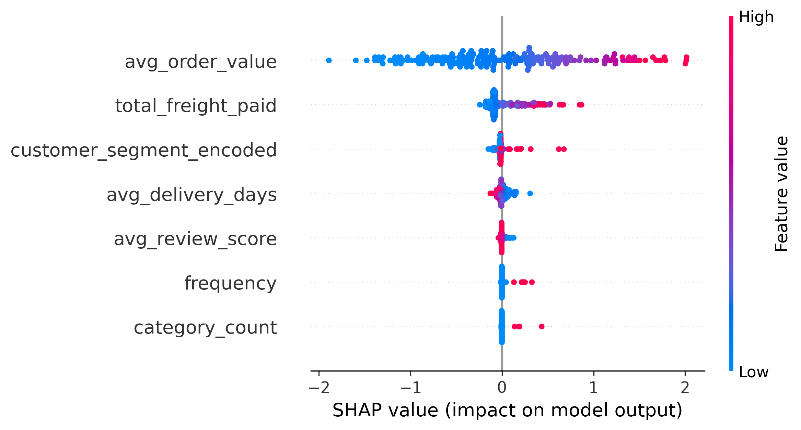
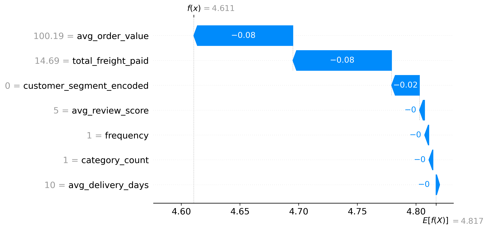

# Customer Spend Prediction Explainability using SHAP

## Objective

While the XGBoost spend prediction model achieved strong predictive performance, understanding why the model predicts higher or lower customer spending is equally important.

To improve transparency and interpretability, SHAP (SHapley Additive exPlanations) was used.

SHAP provides:

- Global feature importance
- Feature impact direction
- Individual prediction explanations
- Business insights for revenue optimization

---

# SHAP Feature Importance Analysis

## SHAP Bar Plot

### Most Important Features

| Rank | Feature |
|--------|----------|
| 1 | avg_order_value |
| 2 | total_freight_paid |
| 3 | customer_segment_encoded |
| 4 | avg_delivery_days |
| 5 | avg_review_score |
| 6 | frequency |
| 7 | category_count |

### Key Finding

Average order value is by far the strongest predictor of customer spending.

Customers with higher historical order values are significantly more likely to generate greater future revenue.

---

# SHAP Summary Plot

## Interpretation

The SHAP summary plot shows both feature importance and the direction of feature impact.

Each point represents a customer.

### Color Meaning

- Blue → Low feature value
- Red → High feature value

### Horizontal Position

- Positive SHAP Value → Increases predicted spending
- Negative SHAP Value → Decreases predicted spending

---

## Average Order Value Impact

Average order value has the largest influence on spend predictions.

Customers with high average order values consistently increase predicted spending.

Customers with low average order values significantly reduce predicted spending.

### Business Insight

Order value is the primary driver of customer revenue.

Increasing basket size can directly improve customer lifetime value.

---

## Freight Cost Impact

Higher freight costs generally contribute positively toward predicted spending.

This indicates that customers purchasing larger or more expensive products tend to generate higher revenue.

### Business Insight

Freight expenditure acts as a proxy for larger purchase volumes.

---

## Customer Segment Impact

Customer segment is the third most important predictor.

Different customer groups exhibit significantly different spending behavior.

### Business Insight

Customer segmentation successfully identifies high-value and low-value customer groups.

---

## Delivery Performance Impact

Delivery performance contributes moderately to spend predictions.

Longer delivery times generally reduce predicted customer spending.

### Business Insight

Efficient logistics can positively influence customer value.

---

# Individual Customer Explanation

## SHAP Waterfall Plot

The waterfall plot explains a single customer prediction.

The model prediction begins from the average spending baseline and is adjusted based on customer-specific characteristics.

### Major Contributors

| Feature | Impact |
|----------|----------|
| avg_order_value | Largest contribution |
| total_freight_paid | Moderate contribution |
| customer_segment_encoded | Moderate contribution |
| avg_delivery_days | Small contribution |
| avg_review_score | Small contribution |

### Example Interpretation

For this customer:

- Average order value reduced predicted spending.
- Freight expenditure reduced predicted spending.
- Customer segment contributed toward a lower spending prediction.
- Remaining features had minimal impact.

The combined effect resulted in a predicted spending value below the population average.

---

# Business Insights

### 1. Average Order Value Drives Revenue

Average order value is the strongest determinant of customer spending.

Increasing basket size should be a primary business objective.

---

### 2. Freight Costs Reflect Customer Value

Customers with higher freight expenditure generally generate more revenue.

Freight costs indirectly capture purchase volume and product value.

---

### 3. Customer Segmentation Improves Revenue Forecasting

Customer segments display distinct spending behaviors.

Marketing campaigns should be tailored to different customer groups.

---

### 4. Logistics Performance Supports Revenue Growth

Delivery performance has a measurable impact on spending behavior.

Improving delivery efficiency may increase customer value.

---

# Conclusion

SHAP explainability successfully transformed the XGBoost spend prediction model into an interpretable business intelligence tool.

The analysis identified:

- Average order value as the dominant driver of customer spending.
- Freight expenditure as a strong secondary indicator.
- Customer segment as an important behavioral predictor.
- Delivery performance as a supporting operational factor.

These insights provide actionable recommendations for improving customer lifetime value and increasing overall business revenue.