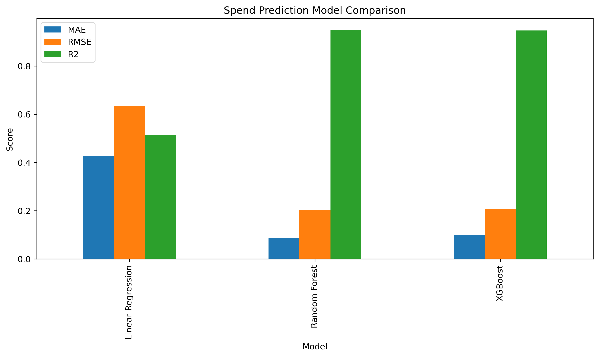

# Customer Spend Prediction Model Comparison

## Objective

The objective of this phase is to compare multiple machine learning regression algorithms and identify the model that provides the most accurate customer spending predictions.

Rather than relying on a single algorithm, multiple models were evaluated to determine the most suitable solution for deployment.

---

# Connection to Previous Phase

In the previous phase, a customer spend prediction system was developed using engineered customer features.

This phase builds upon that work by evaluating different regression algorithms and selecting the strongest model.

---

# Dataset Overview

The dataset contains customer-level behavioral and transactional features generated during previous project phases.

The target variable is:

```python
monetary_log
```

which represents the log-transformed total customer spending.

---

# Features Used

| Feature                  |
| ------------------------ |
| frequency                |
| avg_order_value          |
| category_count           |
| avg_review_score         |
| avg_delivery_days        |
| total_freight_paid       |
| customer_segment_encoded |

---

# Data Preparation

## Target Transformation

Because customer spending was highly right-skewed, a logarithmic transformation was applied.

```python
df["monetary_log"] = np.log1p(df["monetary"])
```

This transformation reduced skewness and improved model stability.

---

# Evaluation Metrics

The following regression metrics were used to evaluate model performance.

| Metric | Description                                   |
| ------ | --------------------------------------------- |
| MAE    | Average prediction error                      |
| RMSE   | Penalizes larger prediction errors            |
| R²     | Proportion of variance explained by the model |

---

# Models Evaluated

Three regression algorithms were compared.

---

# 1. Linear Regression

Linear Regression was selected as the baseline model.

## Advantages

* Simple and interpretable
* Fast training time
* Provides a benchmark for comparison

## Results

| Metric | Value |
| ------ | ----: |
| MAE    | 0.426 |
| RMSE   | 0.633 |
| R²     | 0.515 |

---

## Interpretation

The model explained approximately 51.5% of the variation in customer spending.

While useful as a baseline, it struggled to capture complex customer spending behavior.

---

# 2. Random Forest Regressor

Random Forest was selected as a non-linear ensemble learning model.

## Advantages

* Captures non-linear relationships
* Handles complex feature interactions
* Robust against outliers
* Strong predictive performance

## Results

| Metric | Value |
| ------ | ----: |
| MAE    | 0.086 |
| RMSE   | 0.204 |
| R²     | 0.949 |

---

## Interpretation

Random Forest substantially improved predictive performance and explained approximately 94.9% of spending variation.

---

# 3. XGBoost Regressor

XGBoost was evaluated as an advanced gradient boosting algorithm.

## Advantages

* High predictive power
* Effective handling of non-linear relationships
* Strong regularization capabilities

## Results

| Metric | Value |
| ------ | ----: |
| MAE    | 0.100 |
| RMSE   | 0.208 |
| R²     | 0.947 |

---

## Interpretation

XGBoost achieved excellent performance but remained slightly behind Random Forest across all evaluation metrics.

---

# Model Performance Comparison

| Model             |   MAE |  RMSE |    R² |
| ----------------- | ----: | ----: | ----: |
| Linear Regression | 0.426 | 0.633 | 0.515 |
| Random Forest     | 0.086 | 0.204 | 0.949 |
| XGBoost           | 0.100 | 0.208 | 0.947 |

---

# Model Comparison Visualization



## Findings

The comparison clearly demonstrates the superiority of ensemble learning methods over Linear Regression.

Both Random Forest and XGBoost significantly outperformed the baseline model.

---

# Feature Importance Analysis

## Random Forest Feature Importance

| Feature                  | Importance |
| ------------------------ | ---------: |
| avg_order_value          |      0.868 |
| total_freight_paid       |      0.071 |
| customer_segment_encoded |      0.040 |
| avg_delivery_days        |      0.013 |
| avg_review_score         |      0.004 |
| category_count           |      0.003 |
| frequency                |      0.002 |

---

## XGBoost Feature Importance

| Feature                  | Importance |
| ------------------------ | ---------: |
| avg_order_value          |      0.732 |
| customer_segment_encoded |      0.182 |
| total_freight_paid       |      0.042 |
| frequency                |      0.016 |
| category_count           |      0.014 |
| avg_delivery_days        |      0.008 |
| avg_review_score         |      0.006 |

---

# Feature Importance Findings

### Average Order Value

Both models identified average order value as the strongest predictor of customer spending.

### Customer Segmentation

Customer segmentation emerged as the second most important predictor in the XGBoost model.

### Shipping Costs

Shipping-related costs contributed meaningful predictive information in both models.

---

# Feature Ablation Study

To evaluate the importance of average order value, an additional experiment was conducted by removing the feature from the Random Forest model.

---

## Results

| Model                                   |   MAE |  RMSE |    R² |
| --------------------------------------- | ----: | ----: | ----: |
| Random Forest (With avg_order_value)    | 0.086 | 0.204 | 0.949 |
| Random Forest (Without avg_order_value) | 0.401 | 0.560 | 0.620 |

---

## Interpretation

Removing average order value caused a substantial decline in model performance.

Key observations:

* R² decreased from 0.949 to 0.620.
* MAE increased significantly.
* RMSE increased significantly.

This confirms that average order value is the dominant driver of customer spending.

---

# Final Model Selection

## Selected Model

### Random Forest Regressor

Random Forest was selected as the final production-ready spend prediction model.

---

## Selection Criteria

| Criterion   | Result |
| ----------- | ------ |
| Lowest MAE  | Yes    |
| Lowest RMSE | Yes    |
| Highest R²  | Yes    |

---

## Final Performance

| Metric | Value |
| ------ | ----: |
| MAE    | 0.086 |
| RMSE   | 0.204 |
| R²     | 0.949 |

---

# Business Impact

The selected model enables businesses to:

* Forecast customer spending
* Identify high-value customers
* Improve customer targeting
* Optimize marketing budgets
* Support customer lifetime value initiatives

---

# Conclusion

Three regression models were evaluated:

* Linear Regression
* Random Forest Regressor
* XGBoost Regressor

While both ensemble methods significantly outperformed Linear Regression, Random Forest achieved the strongest overall performance.

The final model achieved:

* MAE: 0.086
* RMSE: 0.204
* R²: 0.949

Based on these results, Random Forest was selected as the final spend prediction model and will be used for future customer value forecasting and business decision-making.
